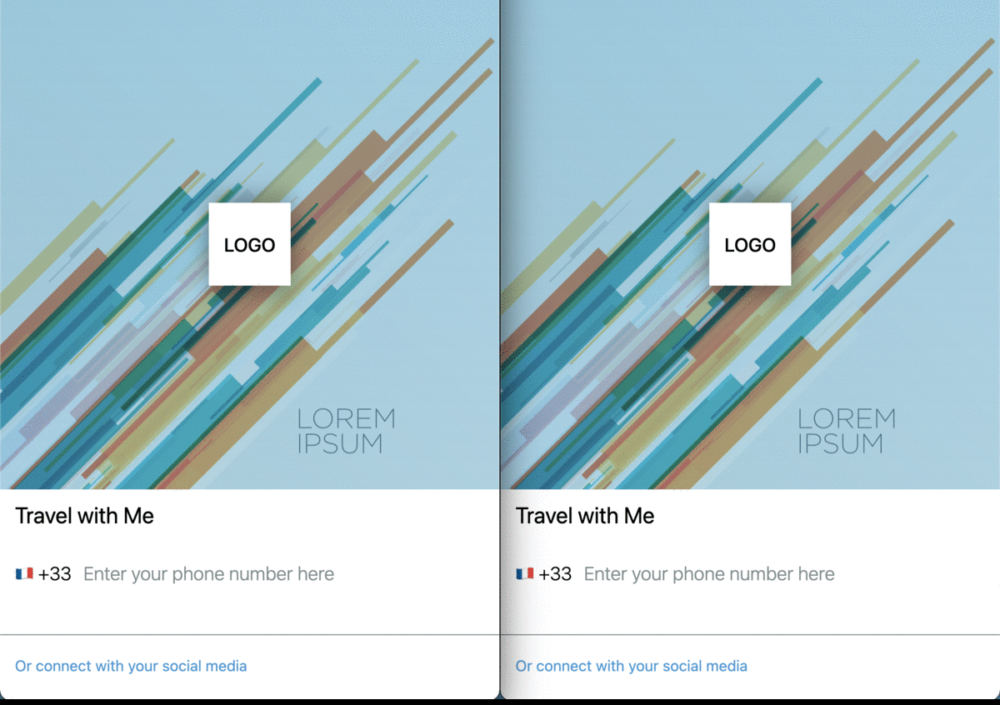

# uberClone

## Overview

    TBU

## Preview

---

---

## Tech stack

> ### Backend
>
> >  : Graphql &nbsp;&nbsp;&nbsp;&nbsp;&nbsp; : NodeJS &nbsp;&nbsp;&nbsp;&nbsp;&nbsp; : PostgresSql&nbsp;&nbsp;&nbsp;&nbsp;&nbsp;

 

> ### FrontEnd
>
> > : ReactJS&nbsp;&nbsp;&nbsp;&nbsp;&nbsp;  : TypeScript&nbsp;&nbsp;&nbsp;&nbsp;&nbsp; : Apollo

## Features

---

- Facebook login
- Phone & Email verification
- Requesting a ride in realtime
- Realtime chat with driver and cutomer
- Getting direction, and render it on map by using Google Map api

---
